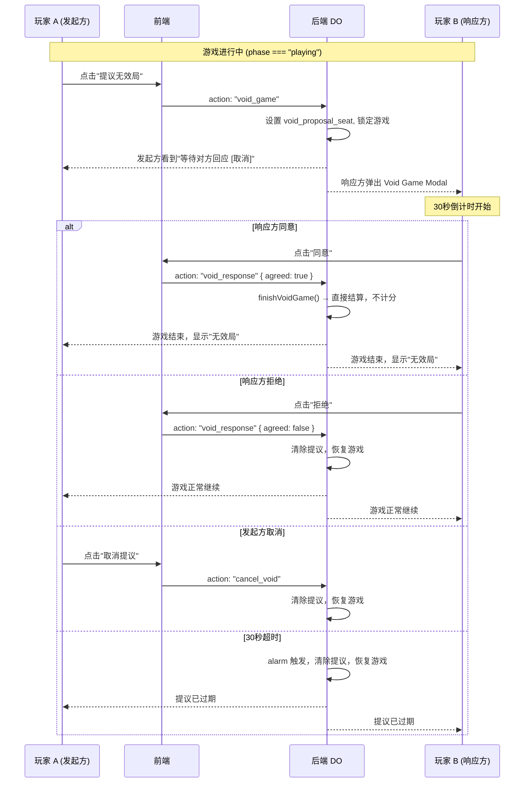

# Void Game (无效局) 功能设计文档

**日期**: 2026-07-08
**状态**: 已批准
**涉及组件**: 后端 game-room-do.ts, 前端 GameScreen.tsx

---

## 1. 概述

新增 Void Game（无效局）功能：游戏进行中时，任一方玩家可提议当前局作废。双方均同意后，游戏直接结算进入结束状态，**不计任何分数**（胜方不扣分，败方不加分，等同于该局从未发生过）。

---

## 2. 交互流程

---

## 3. 数据模型

### game_state 表新增字段

| 字段名 | 类型 | 默认值 | 说明 |
|--------|------|--------|------|
| `void_proposal_seat` | INTEGER | NULL | 发起 Void Game 的座位号，NULL 表示无提议 |
| `void_proposal_timeout` | INTEGER | 0 | 提议超时时间戳（毫秒），超时自动拒绝 |

### JSON 响应新增字段

`GameState` 接口新增可选字段：
- `voidProposalSeat?: number` — 发起方座位号
- `voidProposalTimeout?: number` — 超时时间戳

---

## 4. 后端逻辑（game-room-do.ts）

### 4.1 新 action 处理

在 `playerAction()` 方法中新增三个 action:

**`void_game`** — 发起方提出无效局提议
- 前置条件：`phase === "playing"`，且 `void_proposal_seat` 为 NULL
- 操作：写入 `void_proposal_seat` 和 `void_proposal_timeout`（当前时间 + 30s）
- 暂停游戏（即使轮到当前玩家，对方也不能出牌）

**`void_response`** — 响应方对提议做出回应
- 请求体包含 `{ agreed: boolean }`
- 需要校验：只有非发起方的另一位玩家才能响应
- 同意：调用 4.2 的 `finishVoidGame()`
- 拒绝/超时：清除 `void_proposal_seat` 和 `void_proposal_timeout`，恢复游戏

**`cancel_void`** — 发起方取消提议
- 前置条件：发起方本人，提议仍有效
- 操作：清除提议字段，恢复游戏

### 4.2 finishVoidGame (不计分结算)

新建方法，与 `finishGame` 的主要区别：
- **跳过所有计分逻辑**（不调 `calculateHandScore`，不更新 D1 `users.score`）
- 仍然更新 `room_config.status` 为 `'finished'`，`game_state.phase` 为 `'finished'`，设置 `winner_seat`（设为发起方，虽然两边都不计分）
- 调用 `broadcastState()`

### 4.3 action 前置拦截

在 `playerAction()` 的 `action === "draw_card"|"skip_turn"|"play_card"` 处理前，增加检查：
- 如果 `void_proposal_seat !== NULL`，非响应方发起的相关操作返回错误
- 响应方虽然能看到游戏状态，但正常出牌操作被拦截（只能用 `void_response`）

### 4.4 alarm 超时处理

在 `alarm()` 中新增对 `void_proposal_timeout` 的检查：
- 如果 `void_proposal_seat !== NULL` 且 `Date.now() >= void_proposal_timeout`
- 清除提议字段，调用 `broadcastState()`

---

## 5. 前端逻辑（GameScreen.tsx）

### 5.1 状态监听

从 `gameState` 中读取 `voidProposalSeat`：
- 如果 `voidProposalSeat === localSeat` → 我是发起方，显示"等待对方回应"
- 如果 `voidProposalSeat !== null && voidProposalSeat !== localSeat` → 我是响应方
- 如果 `voidProposalSeat === null` → 无活跃提议

### 5.2 操作栏按钮

`phase === "playing"` 且 `voidProposalSeat === null` 时，显示**"提议无效局"**按钮：
- 位于操作栏，与"摸牌""跳过"同区域
- 点击后调用 `doAction("void_game")`

### 5.3 发起方等待界面

当 `voidProposalSeat === localSeat`：
- 操作栏禁用所有出牌/摸牌/跳过按钮
- 显示文字："⏳ 已提议无效局，等待对方回应..."
- 显示"取消提议"按钮 → `doAction("cancel_void")`

### 5.4 响应方 Modal

当 `voidProposalSeat !== null && voidProposalSeat !== localSeat` 且 `phase === "playing"`：
- 弹出 Modal（复用 `ConfirmModal` 或新建样式），覆盖游戏操作
- 显示："对方提议此局作废（Void Game），是否同意？"
- 两个按钮：
  - **"同意"** → `doAction("void_response", undefined, undefined, undefined, { agreed: true })`
  - **"拒绝"** → `doAction("void_response", undefined, undefined, undefined, { agreed: false })`

### 5.5 超时感知

- 前端不需要自己维护超时，通过 SSE 流收到状态更新自动感知
- 如果当前显示 Void Game Modal 而 `voidProposalSeat` 变回 NULL，自动关闭 Modal

### 5.6 游戏结束提示

当 `phase === "finished"` 且该局由 Void Game 结算：
- 在结束界面上显示"本局为无效局，双方不计分"（区别于正常获胜的"你赢了！"）

> 后端需要传递一个标志指示该局是否为 Void Game 结算——可在 `GameState` 中新增 `voided: boolean` 字段，前端据此渲染不同文案。

---

## 6. 边界情况

| 场景 | 行为 |
|------|------|
| 游戏等待/倒计时/已结束 | 不显示"提议无效局"按钮 |
| 发起方在等待时离线 | 对方收到 SSE 的玩家离线通知，自动触发超时或手动处理 |
| 响应方在 Modal 打开时离线 | 同超时处理，自动拒绝 |
| 一方拒绝后迅速再次提议 | 重新进入提议流程，无冷却限制（YAGNI） |
| quick room 模式 | 同普通房间，不计分逻辑一致 |

---

## 7. 实现要点

- 后端用 SQL 字段控制状态，不引入额外内存状态
- 前端用 `gameState.voidProposalSeat` 驱动 UI，无需额外 useState
- API 兼容：新增字段均为可选，旧客户端不受影响
- 测试要点：提议→同意（不计分确认）、提议→拒绝、提议→取消、提议→超时、发起方离线